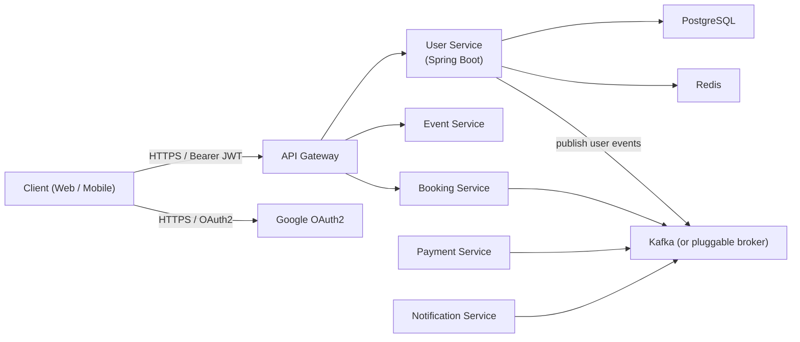
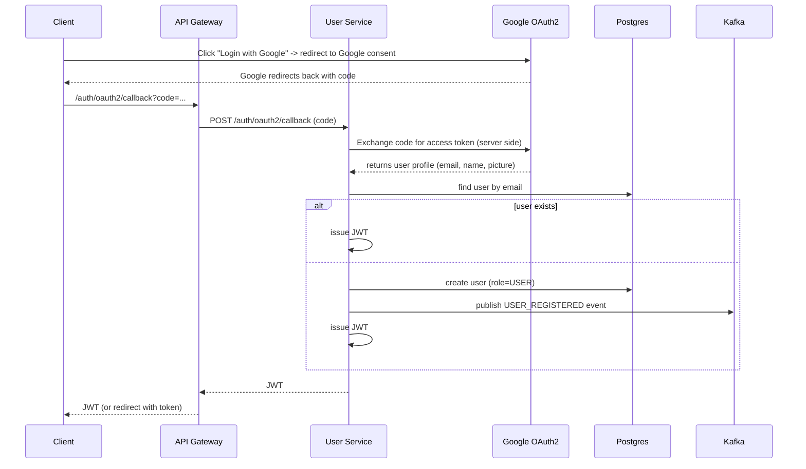

# EventBookingSystem

* High-Level (Context) Diagram





* Component Diagram (Internal User Service)

```mermaid

graph TD
  subgraph user-service
    UC[UserController]
    USvc[UserService]
    Auth[AuthController / OAuth2 Handler]
    LoginSvc[LoginService (strategy factory)]
    EmailLogin[EmailLoginStrategy]
    GoogleLogin[GoogleLoginStrategy]
    Repo[UserRepository (JPA)]
    Mapper[UserMapper (MapStruct)]
    Jwt[JwtTokenProvider]
    MsgPub[EventPublisher (interface)]
    KafkaPub[KafkaEventPublisher]
    RedisCache[Redis (cache)]
    Flyway[Flyway migrations]
    Metrics[Micrometer]
  end

  UC --> USvc
  UC --> LoginSvc
  LoginSvc --> EmailLogin
  LoginSvc --> GoogleLogin
  USvc --> Repo
  USvc --> Mapper
  USvc --> Jwt
  USvc --> MsgPub
  MsgPub --> KafkaPub
  USvc --> RedisCache
  user-service --> Flyway
  user-service --> Metrics


```


* Booking/Signup/Login Sequence (Mermaid) — includes Google OAuth




